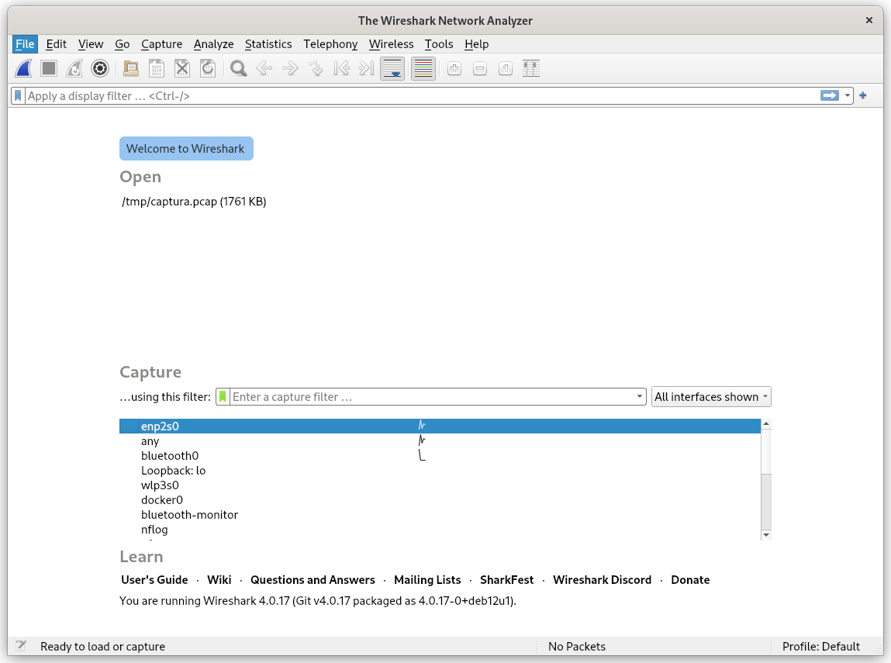

# Avaliação de Redes

## comandos da avaliação

Instalação das ferramentas necessárias para a avaliação:
```sh
sudo apt-get update
sudo apt-get -y install wireshark-common tshark tcpdump
```

Verificando a instalação:
```sh
wireshark --version
```

Esses pacotes não foram instalados:
```sh
tshark --version
tcpdump --version
```

Instalei individualmente:
```sh
sudo apt-get -y install tshark
sudo apt-get -y install tcpdump
```

Verificando após a segunda instalação:
```sh
tcpdump --version
tshark --version
```

Rodando esse comando apenas para garantir:
```sh
sudo apt -y --fix-broken install
```

Comandos para verificar o tráfico tcp da placa ethernet:
```sh
sudo tcpdump -i 1 tcp
sudo tcpdump -D
sudo tcpdump -i enp2s0
sudo tcpdump -i enp2s0 tcp
sudo tcpdump -i enp2s0 tcp -w ./captura.pcap
```

Copiando o arquivo para uma pasta que qualquer um consegue ler o arquivo:
```sh
cp captura.pcap /tmp/
```

OBS.: não é necessário se for criado na pasta de aluno

Dando permissão de leitura:
```sh
chmod 444 /tmp/captura.pcap 
```




Ao abrir, serão apresentadas as capturas feitas pelo tcpdump:


Pesquisar por um IP específico:


