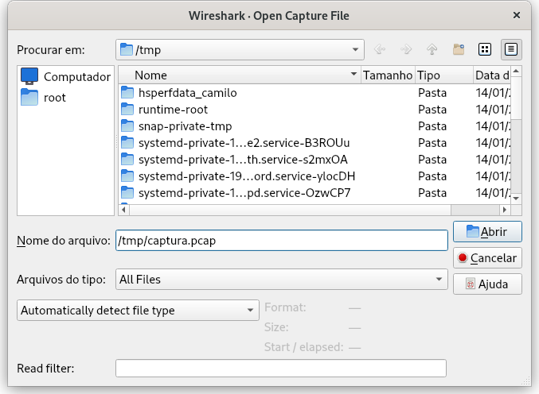
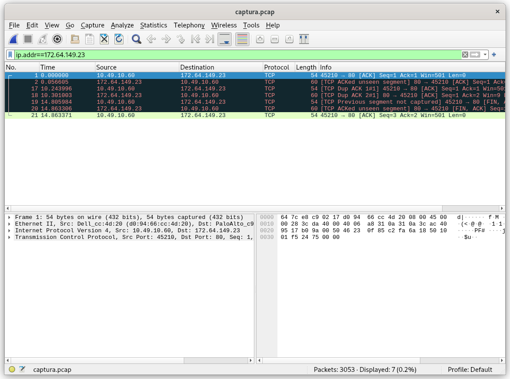

# Avaliação de Redes

## Comandos para instalar ferramentas necessarias

Instalação das ferramentas necessárias para a avaliação:
```sh
sudo apt-get update
sudo apt-get -y install wireshark-common tshark tcpdump
```

Verificando a instalação:
```sh
wireshark --version
```

Esses pacotes não foram instalados:
```sh
tshark --version
tcpdump --version
```

Instalei individualmente:
```sh
sudo apt-get -y install tshark
sudo apt-get -y install tcpdump
```

Verificando após a segunda instalação:
```sh
tcpdump --version
tshark --version
```

Rodando esse comando apenas para garantir:
```sh
sudo apt -y --fix-broken install
```

## Comandos para realizar a captura

Comandos para verificar o tráfego tcp da placa ethernet:
```sh
sudo tcpdump -D
```

O comando abaixo exibe o trafego de rede da placa de rede 1:
```sh
sudo tcpdump -i 1 tcp
```

E equivalente ao comando a seguir:
```sh
sudo tcpdump -i enp2s0
```

Filtrar para trafego TCP:
```sh
sudo tcpdump -i enp2s0 tcp
```

Redirecionando a saida do comando para um arquivo:
```sh
sudo tcpdump -i enp2s0 tcp -w ./captura.pcap
```

Copiando o arquivo para uma pasta que qualquer um consegue ler o arquivo:
```sh
cp captura.pcap /tmp/
```

OBS.: não é necessário se for criado na pasta de aluno

Dando permissão de leitura:
```sh
chmod 444 /tmp/captura.pcap 
```

## Wireshark

Apos isso, e preciso abrir o wiresharkpara visualizar as informacoes do arquivo de captura:
```sh
wireshark
```
O programa sera aberto, apresentando a seguinte interface grafica:


No canto superior direito seleciona-se a opcao "File" e em seguida "Open" para abrir o arquivo. A interface abaixo sera aberta e o caminho do arquivo deve ser acessado/fornecido no campo de texto:


Ao abrir, serão apresentadas as capturas feitas pelo tcpdump:


Para pesquisar por um IP específico, eh preciso formular uma string de busca informando o IP desejado e inserir no campo de texto na parte superior da pagina:


## Exportacao e tratamento dos dados de captura

Por fim, para exportar os dados em formato .csv, sera necessario selecionar "File", "Export Packet Dissections" e "As CSV" como mostra a imagem abaixo:


Convertendo o campo tempo das capturas para o formato Epoch e apresentando o resultado no terminal:
```sh
tshark -r /tmp/captura.pcap -Y tcp -T fields -e frame.time_epoch
```

Redirecionando a saída para um arquivo de texto:
```sh
tshark -r /tmp/captura.pcap -Y tcp -T fields -e frame.time_epoch > /tmp/tempo
```

Exibir portas de origem das capturas:
```sh
tshark -r /tmp/captura.pcap -Y tcp -T fields -e tcp.srcport
```

Redirecionando a saída para umm arquivo de texto:
```sh
tshark -r /tmp/captura.pcap -Y tcp -T fields -e tcp.srcport > /tmp/porta_origem
```

## Adicionar campo tempo e porta de origem na captura exportada
Primeiramente movi/copiei os arquivos gerados no passo anterior para o diretório atual:
```sh
cp /tmp/porta_origem ./csv
cp /tmp/tempo ./csv
```

Depois disso escrevi o seguinte [script](./script.py):
```py
with open("./csv/captura_exportada2.csv", "r") as input, open("./csv/tempo", "r") as f1, open("./csv/porta_origem", "r") as f2:
    input_lines = input.readlines()
    f1_lines = f1.readlines()
    f2_lines = f2.readlines()
with open("./csv/captura_alterada.csv", "w") as captura_alterada:
    for line1, line2, input_line in zip(f1_lines, f2_lines, input_lines):
        captura_alterada.write(f"{input_line.strip()}, {line1.strip()}, {line2.strip()}\n")
```

Esse script é responsável por ler três arquivos, o arquivo .csv com as informações da captura, o arquivo com o tempo criado anteriormente e o arquivo com as portas de origem também criados anteriormente. Após fazer a leitura desses arquivos e criar uma lista com as linhas, essas linhas são iteradas e escritas em um novo arquivo, "[captura_alterada](./csv/captura_alterada.csv)".